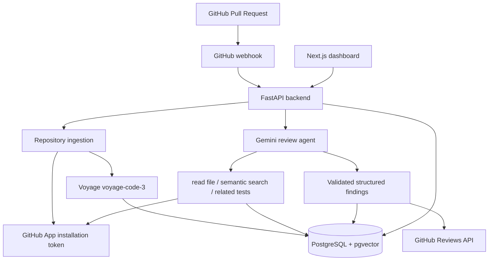

# PR Sentinel

PR Sentinel is an AI-powered GitHub App that reviews pull requests with repository-aware context. A FastAPI service verifies GitHub webhooks, indexes supported source files into PostgreSQL with pgvector, and uses a Gemini tool-calling agent to return validated findings and post an automated GitHub review. A Next.js dashboard exposes connected repositories, review history, findings, and the agent's recorded turns.

**Live dashboard:** <https://pr-sentinel-three.vercel.app>  
**API:** <https://pr-sentinel-production-59e5.up.railway.app>  
**Repository:** <https://github.com/abirsarkar-wp/pr-sentinel>

## Demo

When a developer opens, reopens, or updates a pull request, GitHub delivers a signed webhook. PR Sentinel records the repository and PR, indexes a repository on its first review, gathers repository context while reviewing the diff, then posts an automated GitHub review.

`GitHub PR → signed webhook → FastAPI → indexing / pgvector retrieval → Gemini agent → structured findings → GitHub review`

Subsequent `synchronize` events are also queued for review. The dashboard lets you inspect the result after the background job finishes.

## What It Does

PR Sentinel combines the changed-file diff with targeted repository context. The reviewer can read a file at the PR head SHA, semantically search indexed code, and look for related tests before submitting findings. Findings are validated against a Pydantic schema, passed through a self-critique stage, persisted, and posted as inline GitHub comments where the target line is commentable.

## Key Features

- GitHub App authentication with short-lived, installation-scoped access tokens.
- HMAC-SHA256 verification for GitHub webhook payloads.
- Automatic first-time repository indexing before a webhook-triggered review.
- Source ingestion, Voyage `voyage-code-3` embeddings, and pgvector cosine-similarity retrieval.
- Gemini function-calling review loop with file reading, code search, and related-test lookup.
- Typed, structured findings with category, severity, suggested fix, and confidence.
- A self-critique pass that removes false positives, duplicates, and minor findings.
- GitHub pull-request reviews with confidence-gated inline comments and a summary fallback.
- Persistent repositories, PRs, reviews, findings, and agent traces.
- Next.js dashboard for repositories, PR history, review details, and trace inspection.

## How It Works

1. GitHub sends a `pull_request` webhook for `opened`, `reopened`, or `synchronize`.
2. The backend verifies `X-Hub-Signature-256`, upserts the repository and pull request, and schedules a background task.
3. If the repository has not been indexed, the task clones its default shallow checkout with an installation token and indexes it.
4. Supported source files are split into overlapping chunks, embedded with Voyage, and stored in PostgreSQL/pgvector.
5. The review service fetches PR metadata and changed files from the GitHub API.
6. Gemini receives the PR diff and can call repository tools to gather context.
7. The agent calls `submit_findings`; Pydantic validates the submitted payload.
8. A second Gemini call critiques the draft and returns the final validated findings.
9. The backend persists the review, findings, and per-turn trace data.
10. Findings with confidence of at least `0.5` are posted to GitHub. Findings on commentable diff lines become inline comments; other eligible findings are included in the review body.
11. The dashboard reads the persisted data through the backend API.

## Architecture



## Agent Architecture

The agent is more than a single “send the diff to an LLM” call. It starts with the diff plus PR title and description, then has up to four gather turns to request context. Its system instruction limits findings to actionable bugs, security, performance, missing-test, or genuinely risky issues and requires every finding to point to a changed-file line range.

When enough context has been collected, Gemini submits a typed draft through `submit_findings`. The backend validates that call with `FindingsSubmission`. A separate critique invocation receives the draft and is instructed to discard false positives, duplicates, and nitpicks. The final submission is validated again. Gather and critique interaction steps, latency, token count, and turn count are retained with the review.

## Agent Tools

| Tool | Purpose |
| --- | --- |
| `read_file` | Reads a repository file at the PR head commit (response capped at 8,000 characters). |
| `search_codebase` | Retrieves the five most similar indexed chunks for a natural-language or code-like query. |
| `get_related_tests` | Searches indexed code for test files related to a source path. |
| `submit_findings` | Submits the complete review summary and finding list in the required schema. |

## Finding Schema

`FindingsSubmission` contains a `summary` and a list of `Finding` objects:

| Field | Type / allowed values |
| --- | --- |
| `file` | Repository-relative path |
| `line_start`, `line_end` | Integers identifying a diff range |
| `category` | `bug`, `security`, `performance`, `style`, or `test_coverage` |
| `severity` | `low`, `medium`, `high`, or `critical` |
| `explanation` | Required finding explanation |
| `suggested_fix` | Optional remediation |
| `confidence` | Number from 0 through 1 |
| `summary` | Required pull-request summary on the enclosing submission |

Schema validation prevents a malformed tool call from becoming a persisted review or a GitHub comment.

## Retrieval / RAG Pipeline

Repository ingestion clones with `git clone --depth 1`, ignores common generated/dependency directories, and only considers these extensions: `.py`, `.js`, `.jsx`, `.ts`, `.tsx`, `.go`, `.java`, `.rb`, `.rs`, `.c`, `.cpp`, `.h`, `.hpp`, `.cs`, and `.php`. Files larger than 500,000 bytes are excluded.

Each eligible file is split into 60-line chunks with a 15-line overlap. `voyage-code-3` produces 1,024-dimensional document embeddings, stored in the `vector(1024)` column created by the Alembic migration. Queries use a Voyage query embedding and pgvector cosine distance; the closest five chunks are returned with `similarity = 1 - distance`.

Manual re-ingestion at `POST /repos/{repo_id}/ingest` deletes a repository’s existing chunks before rebuilding them. Automatic indexing only runs when `last_indexed_at` is null; it is not incremental and does not re-index automatically on every PR update.

## GitHub Integration

PR Sentinel authenticates as a GitHub App. It creates a short-lived RS256 app JWT and exchanges it for an installation access token for cloning and GitHub API requests. The webhook endpoint verifies the raw payload with the configured secret before handling events.

For each eligible PR event, the service fetches the PR and up to 100 changed files. It posts a GitHub review with event `COMMENT`. Eligible findings on lines present in the new-side diff are posted inline. Eligible findings outside that view are appended to the review body. Findings below the `0.5` confidence threshold are withheld from GitHub posting but remain persisted with the review.

## Database

Alembic enables the `vector` extension and creates the following persisted entities:

| Entity | Role |
| --- | --- |
| `users` | GitHub user identity and optional encrypted token field; no user-facing auth route is currently implemented. |
| `repos` | GitHub repository identity, installation, connection, and indexing state. |
| `code_chunks` | Source ranges and optional 1,024-dimensional embeddings. |
| `pull_requests` | Repository PR metadata. |
| `reviews` | Review status, summary, token count, and turn count. |
| `findings` | Validated findings belonging to a review. |
| `agent_traces` | Gather/critique turn content and latency. |
| `eval_labels` | Imported evaluation ground-truth labels. |
| `eval_runs` | Aggregate evaluation-run fields, populated only if the evaluation runner completes. |

## Frontend

The frontend is a Next.js 16 application using React 19 and TypeScript. `NEXT_PUBLIC_API_URL` selects the backend and defaults to `http://localhost:8000`.

| Route | View |
| --- | --- |
| `/` | Connected repositories plus review and indexing counts. |
| `/repos/[id]` | Repository pull requests and their latest review status. |
| `/reviews/[id]` | Review summary, findings, usage metadata, and the expandable agent trace viewer. |

The frontend consumes `GET /repos`, `GET /repos/{id}/pulls`, `GET /reviews/{id}`, and `GET /reviews/{id}/traces`.

## Deployment

The deployed frontend URL is configured in the backend CORS allowlist, and the repository’s Git remote matches the URL above. The backend Docker image uses Python 3.12, installs `git` and `requirements.txt`, applies `alembic upgrade head` at startup, then runs Uvicorn. The stated production topology is Railway for FastAPI, Supabase PostgreSQL with pgvector, Gemini and Voyage API services, and Vercel for Next.js.

Set Railway’s backend variables to the values listed below, point the GitHub App webhook URL to:

```text
https://pr-sentinel-production-59e5.up.railway.app/webhooks/github
```

Set Vercel’s `NEXT_PUBLIC_API_URL` to the backend URL. The backend CORS configuration currently includes localhost and the two deployed Vercel origins.

## Local Development

### Prerequisites

- Python 3.12 (the backend Dockerfile uses `python:3.12-slim`)
- Node.js compatible with Next.js 16
- Git
- Docker Desktop (for the local pgvector database)
- A GitHub App installed on a repository, with a webhook secret and private key
- Gemini and Voyage API keys

### Clone

```bash
git clone https://github.com/abirsarkar-wp/pr-sentinel.git
cd pr-sentinel
```

### Start PostgreSQL with pgvector

```bash
docker compose up -d db
```

This uses the repository’s development-only Compose configuration. For a local `.env`, use the matching PostgreSQL connection details, for example `postgresql+psycopg2://prsentinel:<local-password>@localhost:5432/prsentinel`.

### Configure the backend

Create `backend/.env` with placeholders replaced by your own credentials. Never commit it.

```dotenv
DATABASE_URL=postgresql+psycopg2://prsentinel:<local-password>@localhost:5432/prsentinel
GEMINI_API_KEY=<gemini-api-key>
VOYAGE_API_KEY=<voyage-api-key>
GITHUB_APP_ID=<github-app-id>
GITHUB_CLIENT_ID=<github-client-id>
GITHUB_CLIENT_SECRET=<github-client-secret>
GITHUB_WEBHOOK_SECRET=<github-webhook-secret>
# Choose one private-key source:
GITHUB_PRIVATE_KEY_PATH=<path-relative-to-backend>
GITHUB_PRIVATE_KEY=
# Used only by evaluation helpers, not normal reviews:
GITHUB_TEST_INSTALLATION_ID=
GITHUB_EVAL_TOKEN=
ENVIRONMENT=development
```

`GITHUB_PRIVATE_KEY` takes precedence over `GITHUB_PRIVATE_KEY_PATH`. The current code declares client ID and client secret as required settings, although it does not expose an OAuth flow. `GITHUB_EVAL_TOKEN` is only used by evaluation utilities.

### Backend

PowerShell:

```powershell
cd backend
python -m venv venv
.\venv\Scripts\Activate.ps1
pip install -r requirements.txt
alembic upgrade head
uvicorn app.main:app --reload --port 8000
```

Command Prompt activation:

```cmd
backend\venv\Scripts\activate.bat
```

The FastAPI service is available at <http://localhost:8000>; its health endpoint is `/health`.

### Frontend

In another terminal:

```bash
cd frontend
npm install
npm run dev
```

Open <http://localhost:3000>. The default API URL is already the local backend; set `NEXT_PUBLIC_API_URL` only when using another backend.

### Backend container

The supplied `backend/Dockerfile` builds the backend image from the `backend` directory:

```bash
docker build -t pr-sentinel-backend ./backend
docker run --env-file backend/.env -p 8000:8000 pr-sentinel-backend
```

The Compose file provisions only the database, not the backend or frontend.

## Testing

There is no conventional unit-test suite in this repository. Use the following checks to validate the running system.

### 1. Health check

```bash
curl http://localhost:8000/health
```

Expected response: `{"healthy":true}`.

### 2. Frontend check

Open <http://localhost:3000>. Before a GitHub webhook creates a repository record, the dashboard correctly shows no connected repositories.

### 3. Database and migration check

After `alembic upgrade head`, verify that migration output succeeds and inspect the local database:

```bash
docker compose exec db psql -U prsentinel -d prsentinel -c "\dt"
```

The `code_chunks` table requires the pgvector extension created by the first migration.

### 4. Ingestion and retrieval check

After a webhook has created a repository record, trigger an index and query it:

```bash
curl -X POST http://localhost:8000/repos/<repo-id>/ingest
curl "http://localhost:8000/repos/<repo-id>/search?q=<url-encoded-query>"
```

The first call returns `chunks_stored`; the second returns matching file paths, ranges, content, and similarity values. These calls consume Voyage API quota and indexing intentionally throttles free-tier requests.

### 5. Agent and evaluation harness

`backend/eval/run_eval.py` contains an experimental multi-PR evaluator with `full`, `no_retrieval`, and `no_critique` modes. It uses the committed dataset of ten public PR references and writes `backend/EVAL_RESULTS.md` only after a successful run. The evaluator intentionally limits its retrieval corpus to changed files and caps it at 20 chunks because of Voyage free-tier limits.

No completed `EVAL_RESULTS.md` is committed, so this project does **not** claim precision, recall, F1, or false-positive-rate results. The evaluation helper code should be treated as experimental: parts of `eval_agent.py` use an older message-oriented client API while production review code uses the Gemini interactions API.

### 6. End-to-end GitHub test

1. Create a GitHub App with pull-request read/write access and repository contents read access; install it on a test repository.
2. Configure its webhook URL as `http(s)://<reachable-host>/webhooks/github` and set the same webhook secret in `backend/.env`.
3. Run the backend, database, and frontend. For a local webhook endpoint, use an HTTPS tunnel reachable by GitHub.
4. Open a PR, or push a commit to an existing PR. GitHub sends `opened`, `reopened`, or `synchronize`.
5. Confirm backend logs show the signed event, repository/PR persistence, and—on first use—repository indexing.
6. Wait for the background task to fetch the PR, run the agent, and post the review.
7. Check the PR for an automated review; high-enough-confidence findings on valid diff lines appear inline.
8. Open the dashboard to see the repository, review status, findings, token and turn metadata, and trace.

### 7. Controlled security validation

Project notes report a controlled test in which the reviewer identified an intentionally introduced `eval()` vulnerability, such as:

```python
def calculate(expression):
    return eval(expression)
```

That is a useful demonstration of one security-review path, not an accuracy benchmark. The repository does not include a committed fixture or result artifact for reproducing this specific validation.

## API Endpoints

| Method | Endpoint | Purpose |
| --- | --- | --- |
| `GET` | `/` | API status and service identifier. |
| `GET` | `/health` | Health response. |
| `POST` | `/webhooks/github` | Verifies and accepts GitHub webhook events. |
| `GET` | `/repos` | Lists persisted repositories with review/indexing metadata. |
| `POST` | `/repos/{repo_id}/ingest` | Clones, chunks, embeds, and stores a repository. |
| `GET` | `/repos/{repo_id}/search?q=...` | Performs semantic code search. |
| `GET` | `/repos/{repo_id}/pulls` | Lists persisted PRs and their latest review. |
| `POST` | `/reviews/run/{pr_id}` | Manually starts a review for a persisted PR. |
| `GET` | `/reviews/{review_id}` | Returns a review and its findings. |
| `GET` | `/reviews/{review_id}/traces` | Returns persisted agent trace entries. |

## Configuration

| Setting | Implemented value / behavior |
| --- | --- |
| Gemini model | `gemini-3.5-flash-lite` |
| Gather-turn limit | 4 |
| Posting confidence threshold | 0.5 |
| Embedding model / dimensions | `voyage-code-3` / 1,024 |
| Chunking | 60 lines, 15-line overlap |
| Semantic retrieval | cosine distance, top 5 |
| Max source file size | 500,000 bytes |
| Skipped directories | `.git`, `node_modules`, `venv`, `.venv`, `__pycache__`, `dist`, `build`, `.next`, `target`, `vendor` |

## Security Considerations

- Webhook payloads are authenticated with HMAC-SHA256 and `hmac.compare_digest`.
- GitHub API access uses installation tokens rather than a long-lived repository token.
- Private-key material, API keys, tokens, webhook secrets, and database credentials belong in environment variables and are ignored by the repository’s `.gitignore` rules.
- Git clone errors redact the installation token before logging.
- Posting is confidence-gated, but model output is advisory and should not be treated as a merge gate or security guarantee.
- The dashboard/API routes currently have no user authentication or per-user authorization layer; deploy them behind appropriate access controls if exposure is a concern.

## Known Limitations

- Indexing is a full shallow-clone rebuild; it is not incremental and may be slow or expensive for large repositories.
- Ingestion supports a defined source-extension set and ignores files over 500 KB.
- Voyage embedding calls are intentionally throttled for free-tier limits, making large ingestions slow.
- PR file retrieval requests up to 100 changed files; larger PRs are not paginated by the current implementation.
- Review quality is model-dependent. Structured validation ensures shape, not factual correctness.
- The committed evaluation harness has no completed aggregate results and should not be used to claim benchmark accuracy.
- Background work uses FastAPI `BackgroundTasks`, not a durable job queue.

## Future Improvements

- Add AST-aware, language-specific chunking and incremental indexing.
- Add vector indexes and richer hybrid retrieval/ranking.
- Use a durable queue with retries, idempotency, and job observability.
- Paginate GitHub PR files and support more source languages.
- Add authenticated dashboard access and repository-level authorization.
- Modernize and complete the evaluation pipeline with reproducible fixtures and a larger benchmark.

## Project Structure

```text
pr-sentinel/
├── backend/
│   ├── alembic/
│   │   └── versions/
│   ├── app/
│   │   ├── agent.py
│   │   ├── dashboard.py
│   │   ├── ingestion.py
│   │   ├── review_service.py
│   │   └── webhooks.py
│   ├── eval/
│   │   ├── ground_truth/
│   │   └── run_eval.py
│   ├── Dockerfile
│   └── requirements.txt
├── frontend/
│   ├── app/
│   │   ├── repos/[id]/
│   │   └── reviews/[id]/
│   ├── components/
│   └── lib/
├── docker-compose.yml
└── README.md
```

## Technology Stack

| Layer | Technology |
| --- | --- |
| Backend | Python 3.12, FastAPI, SQLAlchemy, Alembic |
| Frontend | Next.js 16, React 19, TypeScript |
| AI | Google Gemini via `google-genai` |
| Embeddings | Voyage AI `voyage-code-3` |
| Database | PostgreSQL |
| Vector search | pgvector cosine-distance search |
| GitHub | GitHub App, Webhooks, REST Reviews API |
| Deployment | Railway backend, Supabase PostgreSQL + pgvector, Vercel frontend |
| Local database | Docker Compose with `pgvector/pgvector:pg16` |

## Why This Project

PR Sentinel explores the engineering boundary between an LLM review and a useful review workflow: repository retrieval gives the model context beyond the diff, typed tool output makes results operational, GitHub integration delivers them where developers work, and persisted traces make the agent’s path inspectable. The project connects those pieces in a deployable FastAPI/Next.js system rather than treating code review as a standalone prompt.

## Resume Highlights

- Built a GitHub App workflow that verifies pull-request webhooks and posts automated review comments through GitHub’s Reviews API.
- Implemented repository-aware code retrieval with 60-line overlapping chunks, 1,024-dimensional Voyage embeddings, PostgreSQL, and pgvector cosine search.
- Developed a Gemini tool-calling review agent with file access, semantic search, typed finding validation, and a self-critique stage.
- Persisted review metadata, findings, and per-turn agent traces, then exposed them through FastAPI endpoints and a Next.js dashboard.
- Containerized the Python backend with Alembic startup migrations and configured a production topology spanning Railway, Supabase/pgvector, and Vercel.
